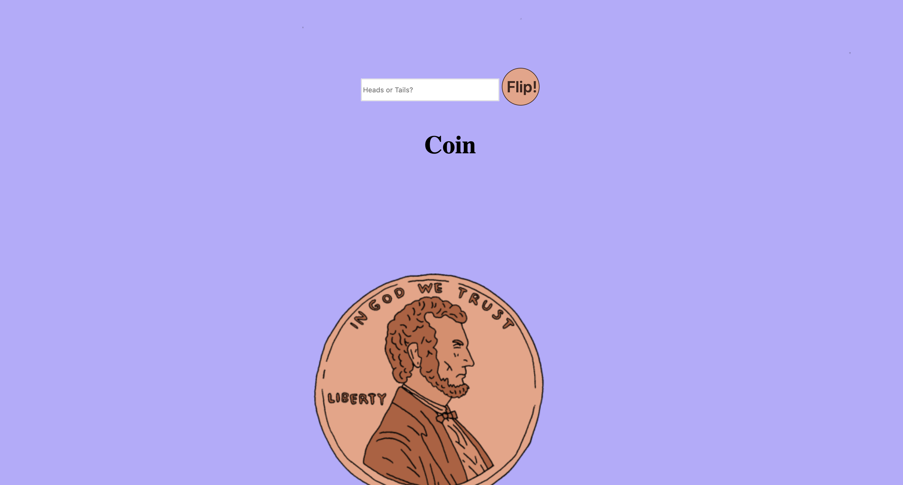

# 💸 Week08 Bootcamp2019a Project: Node Coin Flip Game

### Goal: Create a simple web application that uses the fs and http modules. Use http to create the server and fs to read your html file. Include vanilla ES6 js in a script tag at the bottom of your html file. Try creating a coin flip guessing game



### lessons learned:
```
Solving the game part was fun, the lesson learned here when I learned how to host my work on a local host port 8000 using Node.js .
```
